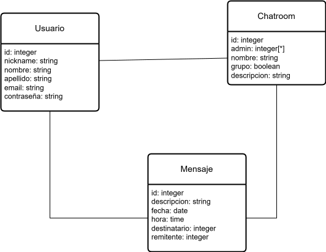

# Propuesta de TP DSW

## Grupo

### Integrantes

- 49741 Romero, Alan Matias
- 49639 Russmann, Octavio Thomas

### Repositorio

- https://github.com/Megax800/Gallium

## Tema

### Descripcion
Gallium es un servicio de mensajeria instantanea basado en web que permite a los usuarios enviar y recibir mensajes en tiempo real, ya sea entre dos usuarios o entre varios por medio de chats grupales. Gallium busca ser intuitivo y amigable con el usuario a la vez que mantiene una estetica sobria y minimalista, centrandose solo en las funciones esenciales que determinan un servicio de chat

### Modelo

## Alcance Funcional

### Alcance Minimo

- Regularidad:

| Req                | Detalle                                                                                                                                                                       |
| ------------------ | ----------------------------------------------------------------------------------------------------------------------------------------------------------------------------- |
| CRUD Simple        | 1. CRUD Chat   2. CRUD Usuario                                                                                                                |
| CRUD Dependiente   |   |
| Listado \+ detalle | 1. Busqueda de usuarios pertenecientes a un grupo   2. Listado de chats(nombre, descripcion, usuarios, mensajes)|
| CUU/Epic           | 1. Crear Chatroom   2. Crear Usuario                                                                                                    |

- Aprobacion Directa

| Req      | Detalle                                                                                                                                       |
| -------- | --------------------------------------------------------------------------------------------------------------------------------------------- |
| CRUD     | 1. CRUD Chat   2. CRUD Usuario 3. CRUD Mensaje|
| CUU/Epic | 1. Alta de Usuario   2. Crear Chat Grupal   3. Enviar un Mensaje   4. Modificar un Chat Grupal   5. Borrar un Chat Grupal|
